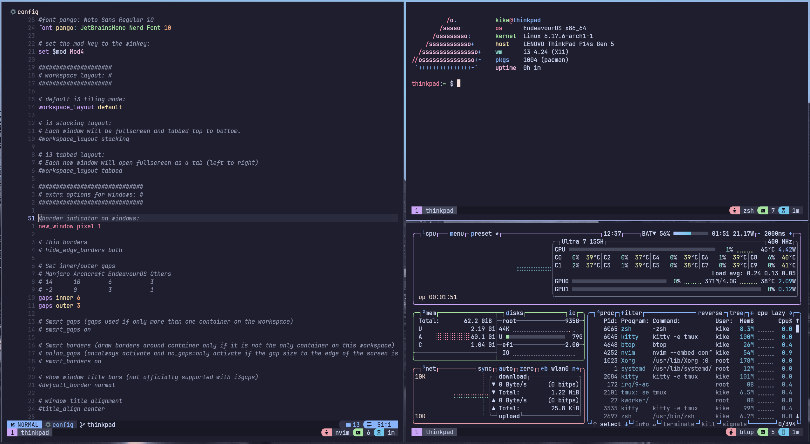

<h1 id="top" align="center">Dotfiles 🚀</h1>



## Installation

1. Download `git` and GNU `stow`.

2. Clone into your `$HOME` directory or `~`.

   ```bash
   git clone -b arch-eos git@github.com:enrique-mendoza/dotfiles.git ~/dotfiles
   ```

3. Run `stow` to symlink everything or just select what you want:

   ```bash
   stow */ # Everything (the '/' ignores the README)
   ```

   ```bash
   stow zsh # Just zsh config
   ```
