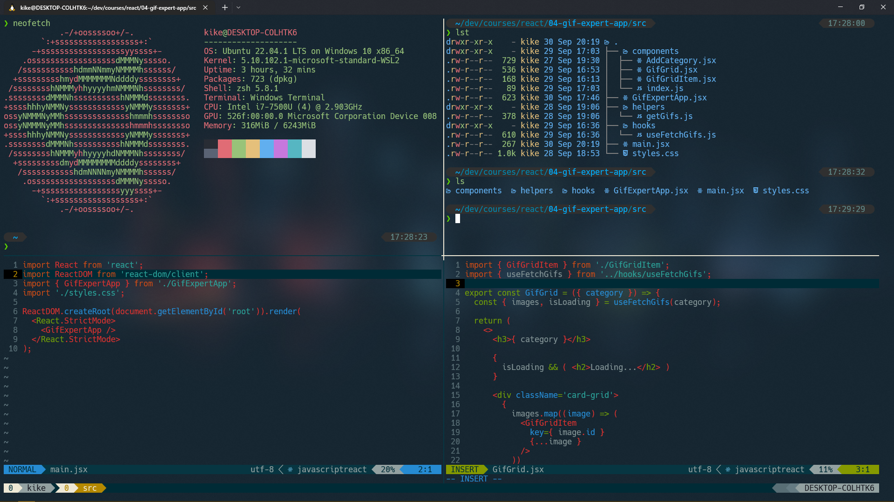

<h1 id="top" align="center"> Dotfiles for Windows 🐶 </h1>



<h1 id="top" align="center"> Windows Config </h1>

<details>
  <summary>Table of Contents</summary>
  <ol>
   <!-- Overview -->
   <li>
      <a href="#overview">Overview</a>
      <ul>
         <li>
            <a href="#recommendations">Recommendations</a>
         </li>
      </ul>
   </li>
   <!-- Windows Terminal -->
   <li>
      <a href="#windows-terminal-windows">Windows Terminal (Windows)</a>
   </li>
   <!-- PowerShell -->
   <li>
      <a href="#powershell-windows">PowerShell (Windows)</a>
      <ul>
         <li>
            <a href="#powershell-setup">PowerShell Setup</a>
         </li>
      </ul>
      <ul>
         <li>
            <a href="#create-new-user-profile">Create new user profile</a>
         </li>
      </ul>
   </li>
  </ol>
</details>

## Overview

This guide will serve to personalize my workspace so I will also add notes that things that I consider importat to remember.

### Recommendations

Due to my guide is based on the guide of others users I recommend watching the following videos:

- [How to set up PowerShell prompt with Oh My Posh on Windows 11](https://www.youtube.com/watch?v=5-aK2_WwrmM&t=1s) by [Takuya Matsuyama](https://github.com/craftzdog)
- [Set up Neovim on a new M2 MacBook Air for coding React, TypeScript, Tailwind CSS, etc.](https://www.youtube.com/watch?v=ajmK0ZNcM4Q&t=147s) by [Takuya Matsuyama](https://github.com/craftzdog)
- [BEST Web Dev Setup? Windows & Linux at the same time (WSL)](https://www.youtube.com/watch?v=-atblwgc63E&t=341s) by [Fireship](https://github.com/fireship-io)

<p align="right">(<a href="#top">back to top</a>)</p>

## Windows 10

### Windows Terminal (Windows)

- [Fonts](https://github.com/ryanoasis/nerd-fonts) - Parched Nerd Fonts

  - **Hack (Hack Regular Nerd Font Complete Mono Windows Compatible)** - Font for Terminal
  - **Fira Code(Fira Code Regular Nerd Font Complete Mono Windows Compatible)** - Font for VSCode

- [Theme](../windows/terminal/settings.json) - Custom theme for terminal

- Extras - Appearance options

  | Menu                                     | Option                          | Value                  |
  | ---------------------------------------- | ------------------------------- | ---------------------- |
  | **Appearance**                           | Acrylic material in the tab row | On                     |
  | **Defaults > Appearance > Text**         | Color scheme                    | One Half Dark (modded) |
  | **Defaults > Appearance > Text**         | Font face                       | Hack NF                |
  | **Defaults > Appearance > Cursor**       | Cursor shape                    | Filled box             |
  | **Defaults > Appearance > Cursor**       | Background opacity              | 50%                    |
  | **Defaults > Appearance > Transparency** | Enable acrylic material         | On                     |

<p align="right">(<a href="#top">back to top</a>)</p>

### PowerShell (Windows)

#### PowerShell setup

- [Scoop](https://scoop.sh/) - A command-line installer

  ```powershell
   Set-ExecutionPolicy RemoteSigned -Scope CurrentUser
   irm get.scoop.sh | iex
  ```

- [Git for Windows](https://gitforwindows.org/) - Version control system

  ```powershell
  winget install -e --id Git.Git
  ```

- [Neovim (>= 0.7)](https://neovim.io/) - Code editor

  ```powershell
  scoop install neovim
  ```

- [Node.js](https://nodejs.org/es/) - JavaScript runtime environment

  ```powershell
  scoop install fnm
  ```

  ```powershell
  fnm completions --shell <SHELL>
  ```

  ```powershell
  fnm install 18.14.0 # Choose your favorite version
  ```

- [Oh My Posh](https://ohmyposh.dev/) - Prompt theme engine

  ```powershell
  scoop install https://github.com/JanDeDobbeleer/oh-my-posh/releases/latest/download/oh-my-posh.json
  ```

  - Set [new theme](https://ohmyposh.dev/docs/themes) replacing name in [User profile config](../windows/powershell/user_profile.ps1)

- [Terminal Icons](https://github.com/devblackops/Terminal-Icons) - Folder and file icons

  ```powershell
  Install-Module -Name Terminal-Icons -Repository PSGallery -Force
  ```

- [z](https://www.powershellgallery.com/packages/z) - Directory jumper

  ```powershell
  Install-Module -Name z
  ```

- [PSReadLine](https://docs.microsoft.com/en-us/powershell/module/psreadline/) - Cmdlets for customizing the editing environment, used for autocompletion

  ```powershell
  Install-Module -Name PSReadLine -AllowClobber -Force
  ```

- [PSFzf](https://github.com/kelleyma49/PSFzf) - Fuzzy finder

  ```powershell
  scoop install fzf
  Install-Module -Name PSFzf -RequiredVersion 2.5.16
  ```

- [LSD](https://github.com/lsd-rs/lsd) - LS with lots of added features

  ```powershell
  scoop install lsd
  ```

  <p align="right">(<a href="#top">back to top</a>)</p>

#### Create new user profile

- Go inside to following folder:

  ```
  C:\
  └── Users
      └── yourUser
          └── .config           # If you don't have this folder, create it
               ├── powershell
               └── scoop
  ```

- Create [new user profile file](../windows/powershell/user_profile.ps1)
- Run and code:

  ```powershell
  vim $PROFILE.CurrentUserCurrentHost
  ```

  ```powershell
  . $env:USERPROFILE\.config\powershell\user_profile.ps1
  ```

<p align="right">(<a href="#top">back to top</a>)</p>
