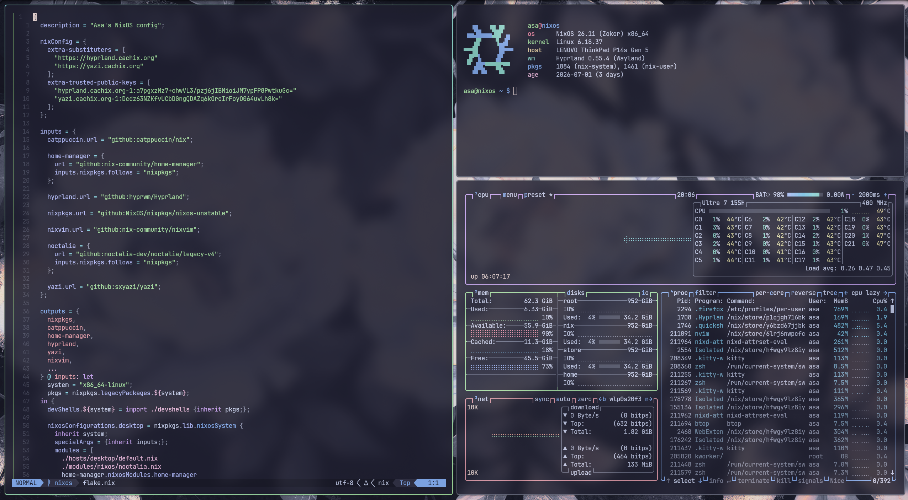

<h1 id="top" align="center">Dotfiles 🚀</h1>



## Installation

### Prerequisites

Install NixOS with the [graphical ISO](https://nixos.org/download/). During installation, choose **No desktop** when prompted to select a desktop environment. Then reboot into the new system.

### Steps

1. You'll be in a TTY (no desktop environment was installed). Enter your user and password.

2. Connect to a network:

   2.1. List available networks:

   ```bash
   nmcli device wifi list
   ```

   2.2. Connect using the SSID and password:

   ```bash
   nmcli device wifi connect "SSID" password "yourpassword"
   ```

3. Edit the config:

   ```bash
   sudo nano /etc/nixos/configuration.nix
   ```

4. Add `git` to `environment.systemPackages` and save the file.

5. Rebuild so `git` is available:

   ```bash
   sudo nixos-rebuild switch
   ```

6. Clone the repo:

   ```bash
   nix-shell -p git --run "git clone -b nixos https://github.com/enrique-mendoza/dotfiles.git ~/dotfiles"
   ```

7. Add the hardware config (gitignored, but Nix needs it tracked to see it):

   ```bash
   cp /etc/nixos/hardware-configuration.nix ~/dotfiles/hosts/desktop/hardware-configuration.nix
   git -C ~/dotfiles add -N -f hosts/desktop/hardware-configuration.nix
   ```

8. Rebuild:

   ```bash
   sudo nixos-rebuild switch --flake ~/dotfiles#desktop
   ```

   This registers the flake as `nixcfg`, so future rebuilds can just run `rebuild`.

   Reboot, then run `rebuild` in `~/dotfiles`, and reboot again.

## Post-installation

1. Undo the earlier intent-to-add:

   ```bash
   git -C ~/dotfiles reset hosts/desktop/hardware-configuration.nix
   ```

2. (Recommended) Use SSH instead of HTTPS for the remote, so you don't need to enter credentials on every push:

   ```bash
   git -C ~/dotfiles remote set-url origin git@github.com:enrique-mendoza/dotfiles.git
   ```
